[Регистрация и установление ролей](#T1) <br>
[Авторизация](#T2) <br>
[Проксирование запросов с учетом ролей пользователя (ROLE_ADMIN, ROLE_POST, ROLE_ALBUMS, ROLE_USERS)](#T3) <br>
[Введение аудита](#T4) <br>
[inmemory кэш](#T5) <br><br>

> Для запуска необходимо настроить файл .properties, указать настройки базу данных. Создать БД texhnotestdb и указать username, password

```properties
spring.datasource.driver-class-name=org.postgresql.Driver
spring.datasource.username=
spring.datasource.password=
spring.datasource.url=jdbc:postgresql://localhost:5432/texhnotestdb\
```

<a name="T1"></a>

### Регистрация и установление ролей

`http://localhost:8080/api/registration`

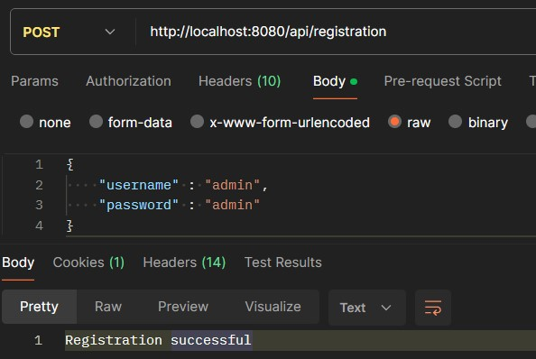

`http://localhost:8080/api/assign/{userId}/{roleId}`


Структура базы данных:
<p align="center">
    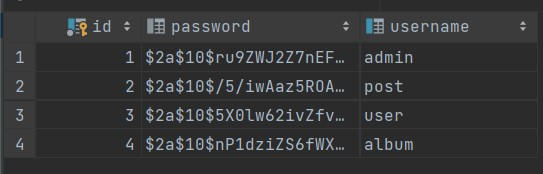
    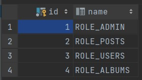
    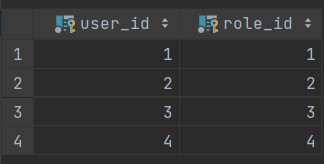
</p>

___

<a name="T2"></a>

### Авторизация

Базовая авторизация с помощью `SpringSecurity`

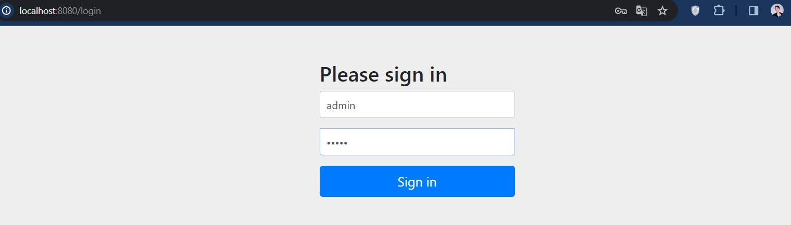

___

<a name="T3"></a>

### Проксирование запросов с учетом ролей пользователя (ROLE_ADMIN, ROLE_POST, ROLE_ALBUMS, ROLE_USERS)

1. пользователь - `admin`, роль - `ROLE_ADMIN` имеет доступ только ко всем обработчикам

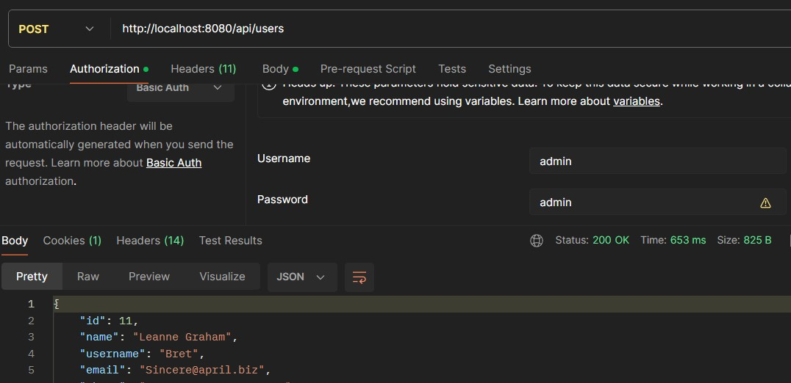
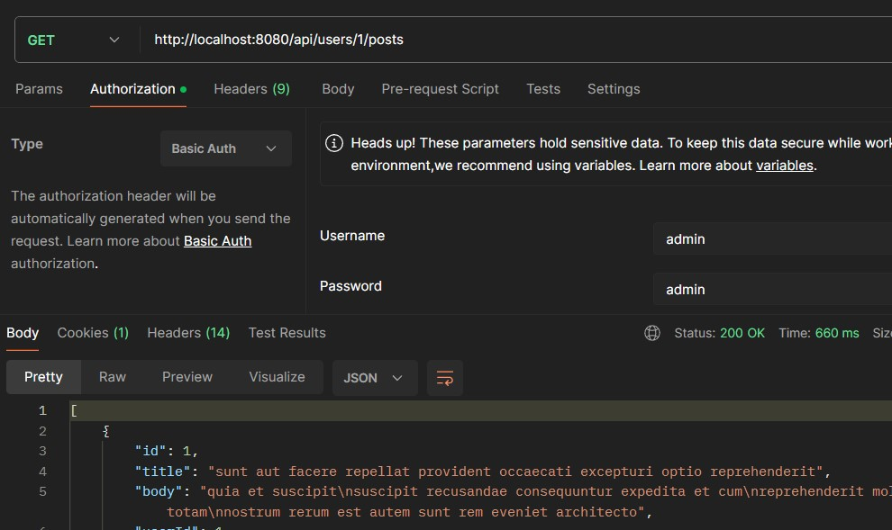
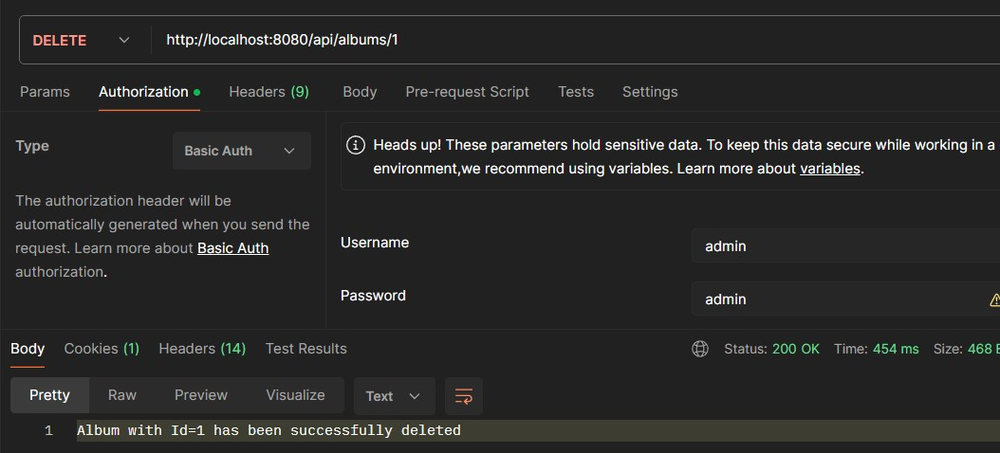

2. пользователь - `post`, роль - `ROLE_POST` имеет доступ только к обработчикам `/api/posts/**`


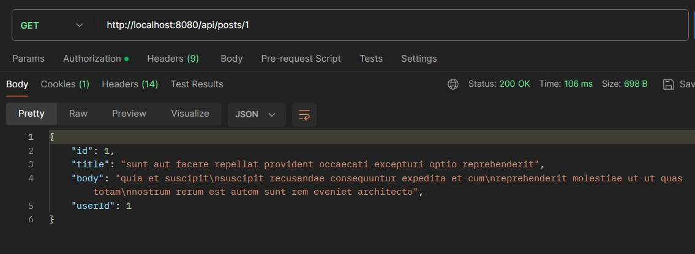
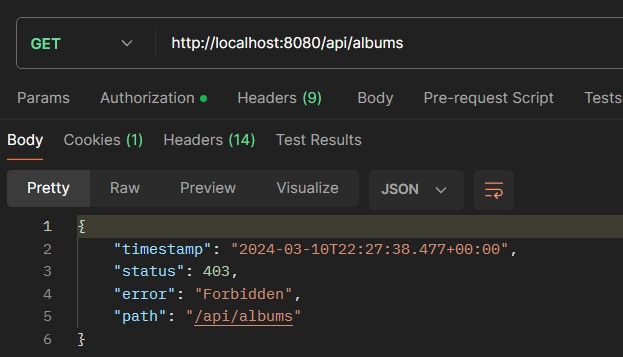

3. пользователь - `album`, роль - `ROLE_ALBUMS` имеет доступ только к обработчикам `/api/albums/**`

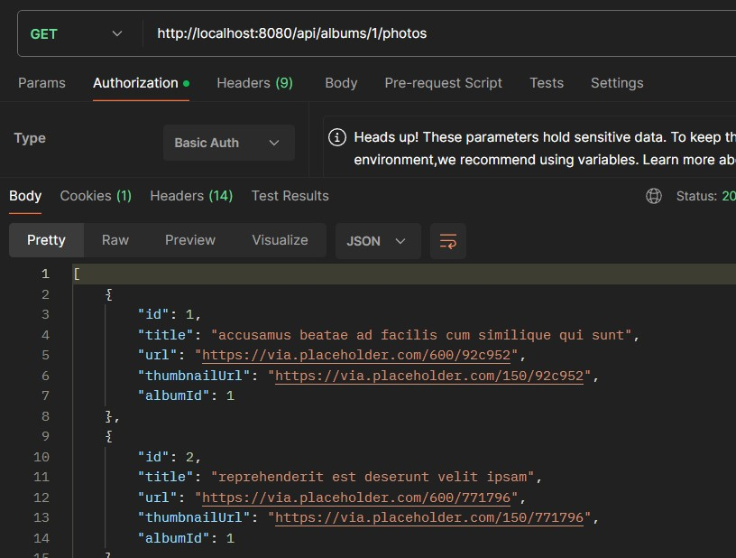
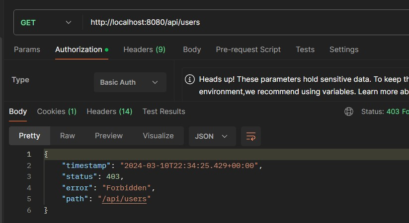

4. пользователь - `user`, роль - `ROLE_USERS` имеет доступ только к обработчикам `/api/users/**`

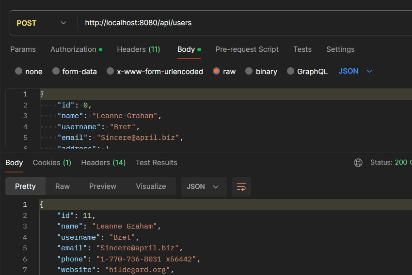

___

<a name="T4"></a>

### Введение аудита

Введение аудита (действие, параметры запроса, роль, имеет ли доступ, дата-время, пользователь)
Данные сохраняются в БД, таблица `audit_log`

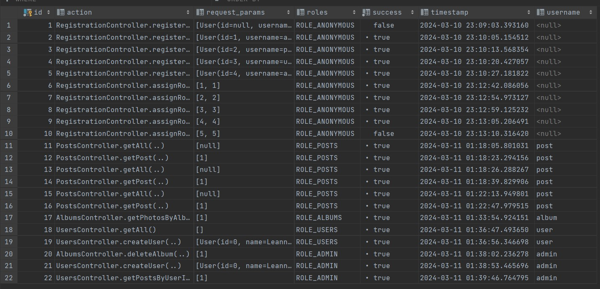

___

<a name="T5"></a>

### inmemory кэш

inmemory кэш, чтобы уменьшить число запросов к jsonplaceholder. Изменения данных сначала должны происходить в кэше, а
потом отправляться запросы на jsonplaceholder.

Реализованно с помощью класса `CacheManager` который принимает данные из запроса, проверяет имеются ли кэшированные
данные в `ConcurrentHashMap`, если имеются то возвращает, иначе отправляет запрос к jsonplaceholder и сохраняет данные
в `ConcurrentHashMap` для следующего обращения.

```java

@Component
public class CacheManager {
  private final Map<String, Object> cache = new ConcurrentHashMap<>();

  public void put(String key, Object value) {
    cache.put(key, value);
  }

  public Optional<Object> get(String key) {
    return Optional.ofNullable(cache.get(key));
  }

  public void evict(String key) {
    cache.remove(key);
  }
}
```

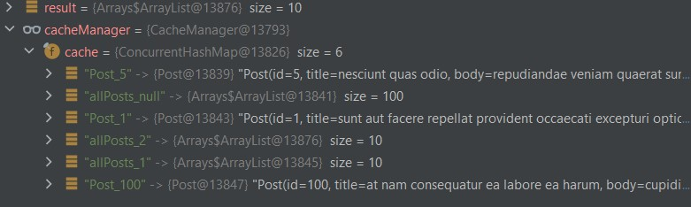


